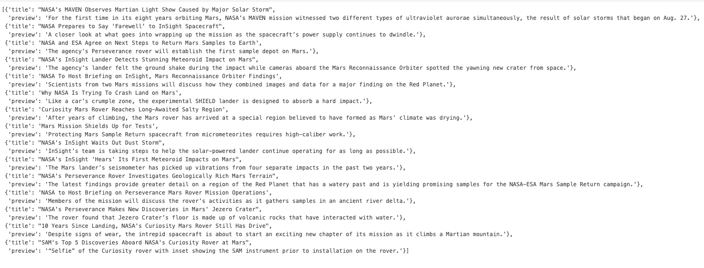
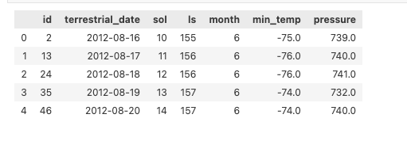
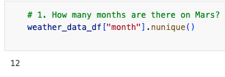
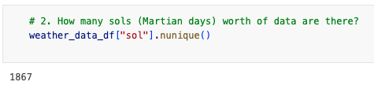
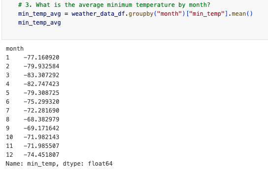
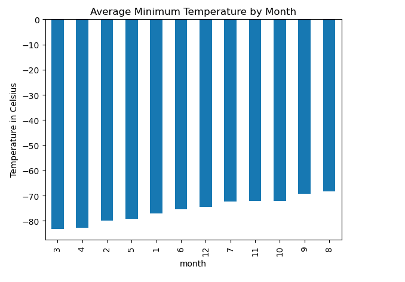
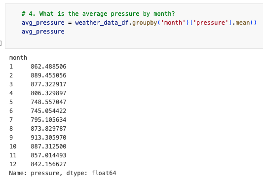
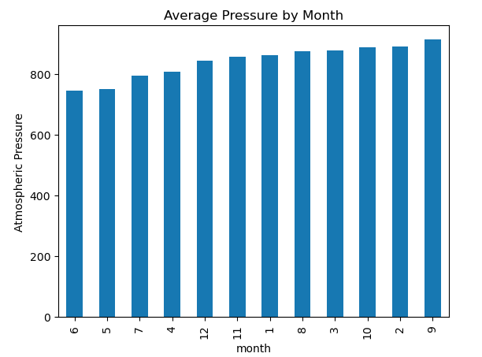
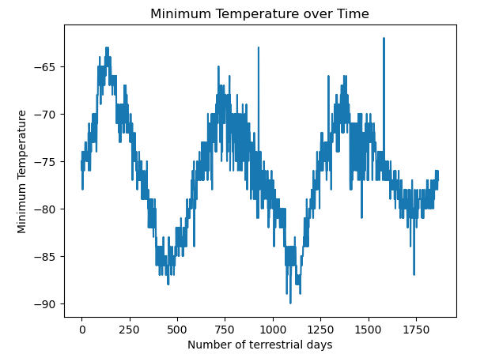

# Data-Collection-Challenge
Module 11 Challenge
# Data Collection Challenge: Mars News & Weather

## Project Overview
This project is part of a Data Collection Challenge, aimed at gathering and analyzing data related to Mars. The project consists of two main parts:

1. **Mars News Scraper** - Collects the latest Mars-related news articles.
2. **Mars Weather Data** - Gathers and processes weather data from Mars.

## Files Included
- `part_1_mars_news.ipynb`: A Jupyter Notebook for scraping and analyzing Mars news articles.
- `part_2_mars_weather.ipynb`: A Jupyter Notebook for collecting and processing Mars weather data.

## Analysis & Outputs
### Part 1: Mars News
- **Process:**
  - Scraped the latest news articles related to Mars.
  - Extracted article titles and summaries.
  - Cleaned and structured the data for easy analysis.
- **Output:**
  - Displayed the latest Mars news articles.
  - Created a summary table of extracted news.
  - Screenshot of output:
  
    

### Part 2: Mars Weather
- **Process:**
  - Collected weather data from the Mars Temperature Data Site.
  - Parsed the temperature and atmospheric pressure data.
  - Conducted basic exploratory data analysis (EDA).
  - Created visualizations for temperature trends and pressure variations.
- **Output:**
  - Generated descriptive statistics for weather data.
  - Plotted trends using matplotlib and seaborn.
  - Created a Pandas DataFrame to easily analyze the data:
  
  - Answered the following questions using the ouput:
        - How many months exist on Mars?
        
        - How many Martian (and not Earth) days worth of data exist in the scraped dataset?
        
        - What are the coldest and the warmest months on Mars (at the location of Curiosity)? 
        
        
        - Looking at the average temperature per month, we can see that the third month of the year is the coldest followed closely by the fourth month. The eighth and ninth months are the warmest. The average for the third month is -83 (rounded) and the average for month eight is -68 (rounded), which is only 15 degrees warmer and still very cold and probably not a place where humans would want to live. 
        - Which months have the lowest and the highest atmospheric pressure on Mars?
        
        
        - The atmospheric pressure is lowest in the sixth month with an average of 745 (rounded) and highest in the ninth month with an average of 913 (rounded). 
        - About how many terrestrial (Earth) days exist in a Martian year? 
        
        - There are peaks in the temperature around the 125 mark, the 750 mark, and the 1375 mark. 750-125 is around 625 days and 1375-750 is around 625 as well. So I would guess the number of terrestrial days in a year is around 625 days.

